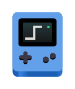
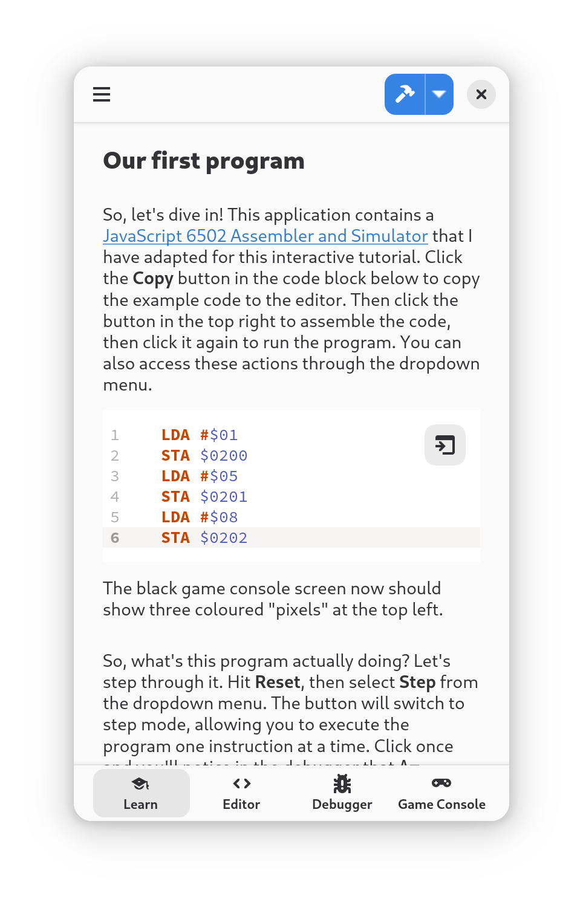

# Learn 6502 Assembly

[](https://www.gnu.org/licenses/gpl-3.0)
[](https://creativecommons.org/licenses/by/4.0/)
[](https://flathub.org/apps/eu.jumplink.Learn6502)

## Modern 6502 Assembly Learning Environment for GNOME



Learn 6502 Assembly is a modern, native Adwaita application for the GNOME desktop environment that provides a complete learning environment for 6502 assembly language programming. Built with GJS and TypeScript, this application brings the classic easy6502 tutorial by Nick Morgan to your desktop as a beautiful, integrated experience.



<a href="https://flathub.org/apps/eu.jumplink.Learn6502">
  
</a>

## Features

- **Interactive Tutorial**: A comprehensive step-by-step guide to learning 6502 assembly language, with explanations of all core concepts
- **Code Editor**: Write and edit your 6502 assembly code with syntax highlighting
- **Assembler & Debugger**: Assemble your code and debug it with a powerful built-in debugger showing registers, flags, and memory in real-time
- **Visual Game Console**: See your code in action on a virtual display, perfect for creating simple games and graphics
- **Built with Modern Technologies**: Developed in GJS and TypeScript with Adwaita styling for a native GNOME experience

This project is a fork of the [original web-based easy6502 tutorial](https://github.com/skilldrick/easy6502), transformed into a native GNOME application while preserving the core functionality that made the original so effective for learning 6502 assembly.

## Packages

- [app-gnome](./packages/app-gnome/README.md): The main GNOME desktop application with Adwaita styling
- [app-web](./packages/app-web/README.md): The classic web application as it originally looked
- [6502](./packages/6502/README.md): The core 6502 simulator, assembler, and disassembler library
- [translations](./packages/translations/README.md): Translation files and build system for localization
- [learn](./packages/learn/README.md): Tutorial content and learning materials
- [vite-plugin-gettext](./packages/vite-plugin-gettext/README.md): Vite plugin for gettext localization support
- [vite-plugin-blueprint](./packages/vite-plugin-blueprint/README.md): Vite plugin for GNOME Blueprint UI files

## Development

### Local Development

To get started with local development:

```bash
# Install dependencies
yarn install

# Build all packages
yarn build

# Start the GNOME application
yarn start:gnome
```

### Flatpak Build

### Building

To build the packages, run `yarn build` in the root of the repository.

### Running

To run the packages, run `yarn start:gnome` for the GNOME app or `yarn start:web` for the web app.

## Contributing

Contributions are welcome :)

## License

- The application code is licensed under the [GNU General Public License v3](LICENSE)
- The tutorial content and all translations are licensed under the [Creative Commons Attribution 4.0 International License](https://creativecommons.org/licenses/by/4.0/)
- The metadata is licensed under the [Creative Commons Zero 1.0 Universal License](https://creativecommons.org/publicdomain/zero/1.0/)