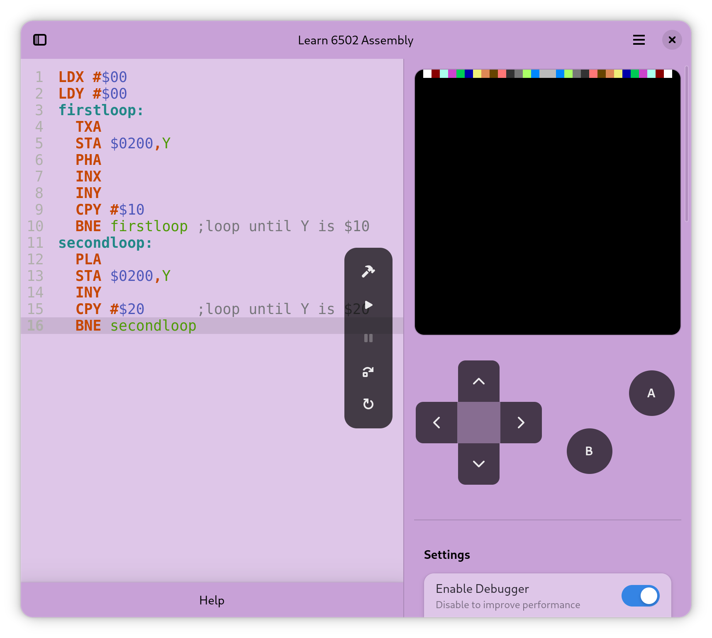

# Learn 6502 Assembly

[](https://www.gnu.org/licenses/gpl-3.0)
[](https://creativecommons.org/licenses/by/4.0/)
[](https://flathub.org/apps/eu.jumplink.Learn6502)
[](https://hosted.weblate.org/engage/eu-jumplink-learn6502/)

## 6502 Assembly Learning Environment for GNOME


Learn 6502 Assembly is a modern, native Adwaita application for the GNOME desktop environment that provides a complete learning environment for 6502 assembly language programming. Built with GJS and TypeScript, this application brings the classic easy6502 tutorial by Nick Morgan to your desktop as a beautiful, integrated experience.



<a href="https://flathub.org/apps/eu.jumplink.Learn6502">
  
</a>

## Features

- **Interactive Tutorial**: A comprehensive step-by-step guide to learning 6502 assembly language, with explanations of all core concepts
- **Code Editor**: Write and edit your 6502 assembly code with syntax highlighting
- **Assembler & Debugger**: Assemble your code and debug it with a built-in debugger showing registers, flags, and memory in real-time
- **Visual Game Console**: See your code in action on a virtual display, perfect for creating vintage games and graphics
- **Built with Modern Technologies**: Developed in GJS and TypeScript with Adwaita styling for a native GNOME experience

This project is a fork of the [original web-based easy6502 tutorial](https://github.com/skilldrick/easy6502), transformed into a native GNOME application while preserving the core functionality that made the original so effective for learning 6502 assembly.

## Packages

- [app-gnome](./packages/app-gnome/): Main GNOME desktop application with Adwaita styling
- [app-android](./packages/app-android/): Android application with NativeScript
- [app-web](./packages/app-web/): Web application version
- [core](./packages/core/): Core 6502 assembler, simulator, and disassembler (published as `@learn6502/core`)
- [common-ui](./packages/common-ui/): Shared UI components and controllers
- [learn](./packages/learn/): Tutorial content and learning materials
- [translations](./packages/translations/): Localization files and build system

## Development

### Local Development

The repository works with **gjsify** (recommended), **npm**, **yarn** or **pnpm** — use whichever you're comfortable with.

```bash
# Recommended — gjsify (the canonical toolchain)
gjsify install
gjsify run build
gjsify run start:gnome
```

Prefer npm / yarn / pnpm? They all work too — each installs the workspaces and resolves the internal dependencies; the build itself still runs through gjsify (it's a dev dependency, so its bin is available after any install):

```bash
npm install        # or:  yarn install   |   pnpm install
npm run build && npm run start:gnome      # or the yarn / pnpm equivalent
```

Notes:

- **gjsify is the canonical path** — the committed `gjsify-lock.json` and the offline Flatpak build use it. npm/yarn/pnpm generate their own lockfiles (gitignored); they're fine for local dev, please don't commit them.
- **pnpm** relies on the committed `pnpm-workspace.yaml` (pnpm reads its workspace members + settings there, not the `workspaces` field or a project `.npmrc`): `linkWorkspacePackages: true` (plain `^` ranges link the local workspaces), `nodeLinker: hoisted` (flat layout the gjsify bundler needs), `minimumReleaseAge: 0` + `dangerouslyAllowAllBuilds: true` (match npm/yarn's defaults — no new-version quarantine, run dep build scripts — so non-interactive installs don't error).
- The internal packages use plain `^x.y.z` ranges (not the `workspace:` protocol), which is why every manager — including npm and classic yarn — can resolve them.
- A manual **Package Managers** CI workflow verifies all four managers install + resolve the workspaces; trigger it from the Actions tab if you touch the dependency wiring.

### Flatpak Build

### Building

To build the packages, run `gjsify run build` in the root of the repository.

### Running

To run the packages, run `gjsify run start:gnome` for the GNOME app or `gjsify run start:web` for the web app.

### Releasing

Versioning, changelogs and npm publishing are managed with [Changesets](https://github.com/changesets/changesets) (see [`.changeset/README.md`](.changeset/README.md)). Add a changeset with your change (`gjsify run changeset`, or `npm`/`yarn`/`pnpm run changeset`). All `@learn6502/*` packages are version-locked and bump together; only `@learn6502/core` is published to npm (the rest are private). Maintainer release: `… run changeset:version` then `… run changeset:publish`.

## Contributing

Contributions are welcome :)

## License

- The application code is licensed under the [GNU General Public License v3](LICENSE)
- The tutorial content and all translations are licensed under the [Creative Commons Attribution 4.0 International License](https://creativecommons.org/licenses/by/4.0/)
- The metadata is licensed under the [Creative Commons Zero 1.0 Universal License](https://creativecommons.org/publicdomain/zero/1.0/)
